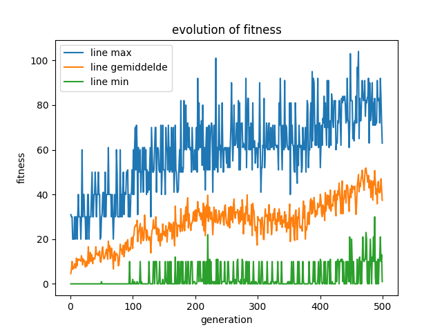
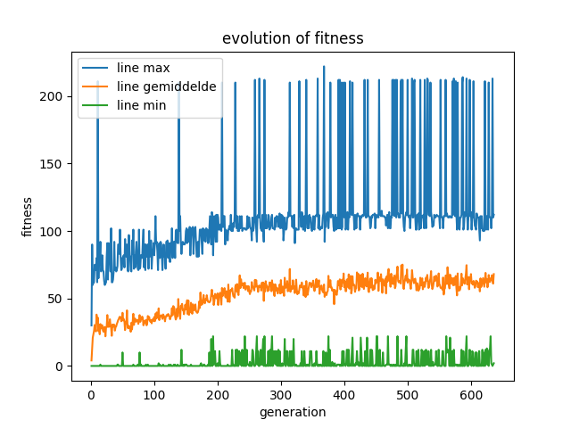

# Centipede bot

## Doelstellingen
### hoofd doel
Op de eerste plaats is het de bedoeling om een bot te maken die het spel 'centipede' kan spelen. Dit spel is een klassieker uit de jaren 80 en was zeer populair in de arcadehallen. Naast het feit dat de bot het spel moet kunnen spelen, is het ook da bedoeling dat hij alles zelf aanleert. Dit wil zeggen dat de bot zelf moet leren hoe het spel werkt en hoe hij het best kan spelen.
### supdoel
Een tweede doel is een scorelimiet opleggen wat hij zou moeten halen. Dit is een extra uitdaging om te evolueren of de AI genoeg getraind is. Dit scorelimiet kan verhoogd worden naarmate de bot beter wordt maar ligt nu op 500 punten.

## Analyse
Het project valt onder te delen in 3 grote groepen. Eerst moet het spel gemaakt worden. Dit zal de omgeving zijn waarbinnen de AI zal getraind worden. Vervolgens moet de AI gemaakt worden. Deze zal het spel moeten spelen en leren. Als laatste moet de AI trainen. Dit is het proces waarin de AI leert hoe het spel werkt en hoe hij het best kan spelen.
### centipede spel
Ik heb gekozen voor een simpelere versie van het spel. Hier zijn dan ook 2 redenen voor.
1. De AI moet het spel leren zondere enige voorkennis. Dit wil zeggen dat de AI niet weet wat de regels zijn en hoe het spel werkt. Als het spel te complex is, zal de vooruitgang van de AI moeilijker te volgen zijn.
2. Om zeker te zijn dat het project op tijd af was heb ik er voor gekozen om meer tijd te steken in de AI en minder in het spel. Dit wil zeggen dat het spel simpeler is en dus sneller gemaakt kan worden.

### AI 
Na projecten gemaakt te hebben met A* en deep Q-learning, heb ik voor iets gekozen waar ik nog geen ervaring mee had. Om de uitdaging te behouden is er gewerkt met een simpel evolutionair algoritme. Dit is een algoritme dat werkt met een populatie van individuen die elk een eigen strategie hebben. Deze individuen worden dan getraind en de beste worden geselecteerd om te overleven. Deze zullen dan weer nieuwe individuen maken en zo gaat het proces verder. Dit is een zeer simpel algoritme maar kan zeer goed werken voor dit project.

### training
Het trainen van een evolutionair algoritme kan lang duren. Er zijn echter wel een aantal manieren om dit te versnellen.
1. De eerste manier is om de AI te laten trainen op een snellere versie van het spel. Dit wil zeggen dat het spel sneller gaat en de AI dus meer ervaring kan opdoen in een kortere tijd.
2. De tweede manier is om de AI te laten trainen op een simpelere versie van het spel. Dit wil zeggen dat het spel minder complex is en de AI dus sneller kan leren hoe het spel werkt.
3. De derde manier is om meerdere AI's tegelijk te laten trainen. Dit wil zeggen dat er meerdere AI's tegelijk het spel spelen en leren. Dit kan de training versnellen omdat er meer ervaring opgedaan wordt in een kortere tijd.

## resultaat

### centipede spel
De simpele versie van et spel centipede is gemaakt. Dit het spel waar enkel de bugblaster, mushrooms en centipedes aanwezig zijn. los van een paar kleine bugs werkt het spel zoals het hoort.

### AI
Het evolutionair algoritme is gemaakt en werkt zoals het hoort. De AI is is dan ook instaat om de bugblaster te besturen en te leren hoe het spel werkt. De AI kan ook de score bijhouden en de beste individuen selecteren.

### training
De AI heeft een aantal keer getraind met verschillen populaties en iteraties. Ook al heeft de Ai nog niet het scorelimiet gehaald, is er wel een duidelijke vooruitgang te zien. De AI kan nu al beter spelen dan in het begin. Om dit aan te tonen heb ik een aantal grafieken gemaakt die de vooruitgang van de AI tonen.
#### population 20

#### population 50

## Uitbreiding
### centipede spel
Het zou natuurlijk mooi zijn om de bot het volledige spel te kunnen laten spelen. Dit wil zeggen dat er nog een aantal dingen moeten toegevoegd worden aan het spel. Zo zou het spel moeilijker gemaakt kunnen worden door meer centipedes toe te voegen of door de snelheid van de centipedes te verhogen. Ook zouden er nog meer objecten kunnen toegevoegd worden zoals power-ups of andere vijanden.
### AI
Het evolutionair elgoritme kan nog aangepast worden. zelf heb ik hier vrij weinig mee geexperimenteerd. Zo zou de selectie van volgende populatie en de mutatie op een volledig andere manier kunnen gebeuren. Ik heb hier niet voor gekeken aangezien ik de AI elke leer zou moeten laten trainen maar dir ken een grote invloed hebben op de snelheid en de kwaliteit.
### training
Hoe langer de AI traint, hoe beter die wordt. Daarnaast is het ook aangeraden om een grotere populatie te gebruiken. Dit zal de trainsnelheid verlagen maar de AI zal betere resultaten behalen.

## Conclusie
Ondaks het feit dat de AI geen score van 500 heeft behaald ben ik tevreden met het resultaat. Dit project was een uitdaging waaruit ik veel heb bijgeleerd. Dat is ook de reden waarom het zeker de tijd waart was. Dit voelde niet aan als een schoolopdracht maar als een kans om nieuwe AI strategien op te gaan zoeken en uit te werken. Achteraf gezien was het miscchien toch mogelijk om de AI beter te laten trainen maar voor mij is het belangrijkste dat er uit de score en fitness kan worden afgelijd dat de bot effectief beter wordt.
## Bibliographie